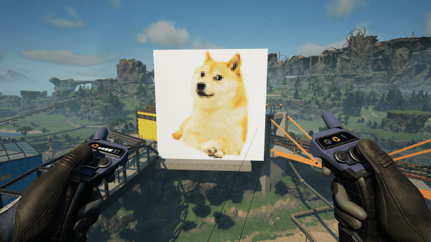

# Satisfactory Signs Image Builder

This tool converts an JPG image into Satisfactory blueprint files that can be later build in the game and create a "poster" of your image. It is using the awesome [etothepii4/satisfactory-file-parser](https://github.com/etothepii4/satisfactory-file-parser) that made it possible.

This script creates a vanilla blueprint built from an array 1m Signs. It is not a mod, does not add anything extra to the game, works on local games as well as servers and should rather not be broken by any game updates (unless they change something with the Signs). The blueprint files can be easily shared with others just like other blueprints.

**Take this project as it is. It was my fun proof of concept side project and I am not intending to maintain it. It is quite simple so it can be easily modified.**

Example of an 64x64 image built with 1m Signs:

## How to build the Blueprint files by using Windows executable

1. Download the pre compiled [ssib.exe](http://github.com/labmonkey/satisfactory-signs-image-builder/releases/latest/download/ssib.exe) file.
2. Prepare your image.  
   This script supports only JPG, square images that have sizes that are divisible by 32 (32x32, 64x64, 128x128 etc).
3. Open your terminal in the directory of the executable and type `./ssib.exe <NAME> <PATH>`, where:
   - `NAME` is the desired name of the Blueprint in the game
   - `PATH` is the path of your source image file. The resulting blueprints will be in the `output` directory.

   For example `./ssib.exe DOGE ./assets/doge64.jpg`

## How to build the Blueprint files by using NodeJS

1. You will need NodeJS. Download it from [https://nodejs.org/en/download](https://nodejs.org/en/download). I recommend the latest LTS version.
2. Prepare your image.  
   This script supports only JPG, square images that have sizes that are divisible by 32 (32x32, 64x64, 128x128 etc).
3. Build the project. Open your terminal in this project directory and type `npm run build` then run it by `npm start <NAME> <PATH>`, where:
   - `NAME` is the desired name of the Blueprint in the game
   - `PATH` is the path of your source image file. The resulting blueprints will be in the `output` directory.

   For example `npm start DOGE ./assets/doge64.jpg`

## How to add it to the game

1. Go to the `output` directory and copy your desired blueprint files to the [game directory](https://satisfactory.wiki.gg/wiki/Blueprint#Save_Location). The amount of the files depends on the size of your image.
2. Restart your game or server
3. The blueprints should be visible in the Undefined category in your Blueprint build menu.

## How to build it in the game

This script is splitting images in to sections that have sizes of 32x32 pixels (Which is an array of 32x32 1m Signs in the game).

Below is the layout of the way sections are created. Each section is named as `ROW x COLUMN` started from bottom left and going to top right. So for example with 6x64 image you will place Section 1x1 first, then 1x2 on the right side of it, then 2x1 on top of the 1x1 and so on.

|           | Column 1 | Column 2 | Column B ... |
| --------- | -------- | -------- | ------------ |
| Row A ... |   Ax1    |   Ax2    |  AxB         |
| Row 2     |   2x1    |   2x2    |  2xB         |
| Row 1     |   1x1    |   1x2    |  1xB         |

## Few tips and notes about performance:

- The Signs do not snap that well so it might be easier to build a huge wall behind and then try to align the blueprint sections with it.
- Each section costs `1024 x Reinforced Iron Plate` and `5120 x Quartz Crystal`. This requires a lot of inventory space and is only possible to be built in later stages of the game when you unlock enough inventory slots (You need `37` slots).
- I did not notice performance drops after the "Poster" of 64x64 was built. The bigger the image the worse it can get so be careful. 
- While you place the blueprint the hologram will cause big FPS drop but it will go back to normal as soon as you exit build mode.
- There is some limit of how many Signs are loaded at same time so after you build it or load the "Poster" by being around it you will see that the signs will be slowly loaded and their contents replaced 1 by 1. In my 64x64 image it took about 30 second before it was fully loaded for first time.
- The games saves memory and the signs are unloaded when you leave the area of your "Poster". It will load again when you get back to it but then it will do it slowly as explained in point above. This means that if you often leave your base then it will spend most time trying to load rather than displaying full picture.